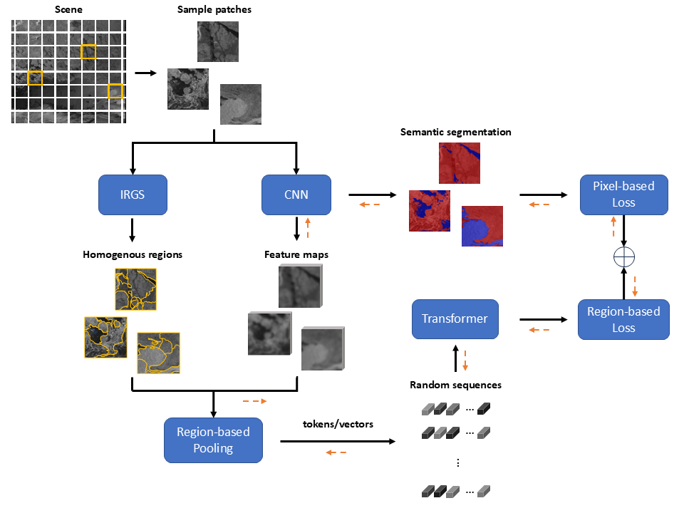

# ITT: Irregular Tokens on Transformers

This is the code base for the paper ITT: Long-range Spatial Dependencies for Sea Ice Semantic Segmentation

Contributions:

- Combination of CNNs, transformers, and unsupervised segmentation to successfully classify ice and open water in SAR images. 

- Incorporation of local and global context to address non-stationary statistics, ensuring confident predictions and more detailed segmentation around boundaries.

- This method constitutes the first attempt to uniquely implement self-attention on tokens extracted from irregular, homogeneous, and multi-scale regions within the input image.

- The code includes the experimental protocols employing dual-polarized images from the RADARSAT-2 sensor.

